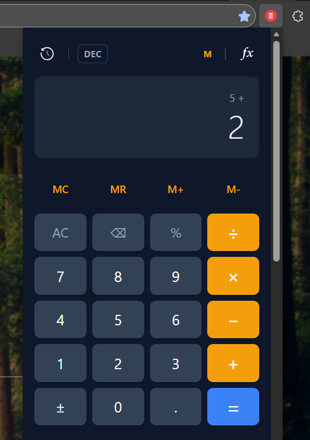
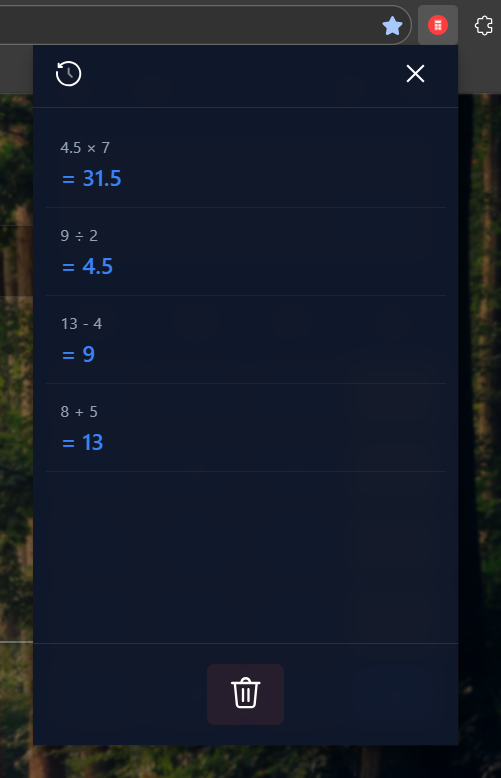
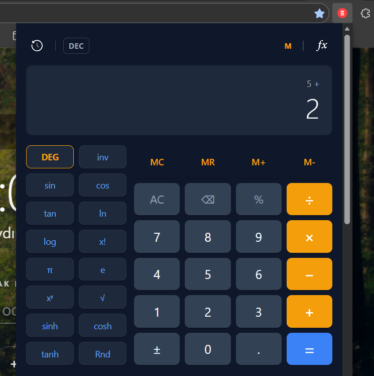

# 🧮 Profesyonel Bilimsel Hesap Makinesi (Chrome Extension)


[🇹🇷 Türkçe](#-türkçe) | [🇬🇧 English](#-english) | [🇹🇷 Ekran Görüntüleri](#ekran-görüntüleri) | [🇬🇧 Screenshots](#screenshots)

---

## 🇹🇷 Türkçe

**[Google Web Store Bağlantısı: https://go.emrecb.com/bilimsel-hesap-makinesi-web-store](https://go.emrecb.com/bilimsel-hesap-makinesi-web-store)**

### 📌 Proje Hakkında

**Profesyonel Bilimsel Hesap Makinesi**, standart web teknolojilerinin sınırlarını zorlayan, yüksek matematiksel hassasiyete sahip, modern arayüzlü ve çevrimdışı çalışabilen bir Chrome tarayıcı eklentisidir.

Bu proje, standart hesap makinelerinin aksine, JavaScript’in bilinen kayan nokta (floating-point) hatalarını (örn: `0.1 + 0.2`) gideren özel bir matematik motoru üzerine inşa edilmiştir. Kullanıcı deneyimini en üst düzeye çıkarmak için **Glassmorphism** tasarım dili kullanılmış ve tamamen duyarlı (responsive) bir yapı kurulmuştur.

### ✨ Öne Çıkan Özellikler

* **Özel Matematik Motoru:** Klasik JavaScript aritmetik hatalarını engelleyen, 14 basamak hassasiyetli özel algoritma.
* **Hibrit Görüntüleme:** Ondalık (Decimal) ve Kesir (Fraction) modları arasında anlık geçiş imkanı (Örn: `0.5` yerine `1/2` gösterimi).
* **Dinamik Arayüz:** Standart moddan Bilimsel moda geçişte genişleyen, CSS animasyonlu akıcı pencere yapısı.
* **Kalıcı Hafıza & Geçmiş:** Tarayıcı kapansa bile verileri saklayan **Chrome Storage API** entegrasyonu ve interaktif işlem geçmişi paneli.
* **Gelişmiş Fonksiyonlar:** Trigonometri (RAD/DEG), Logaritma ve Hiperbolik fonksiyon desteği.

### 🛠 Kullanılan Teknolojiler

* **Core:** Vanilla JavaScript (ES6+), OOP (Nesne Yönelimli Programlama)
* **UI/UX:** HTML5, CSS3 (Grid, Flexbox, CSS Variables, Backdrop Filter - Glassmorphism)
* **API:** Chrome Extension Manifest V3, Storage API, Clipboard API

### 🚀 Kurulum ve Geliştirme (Local)

Bu projeyi bilgisayarınızda geliştirmek veya incelemek için:

1.  Repoyu klonlayın:
    ```bash
    git clone [ps://github.com/emrecagri/professional-scientific-calculator-chrome-extension.git)
    ```
2.  Google Chrome tarayıcısını açın ve adres çubuğuna şunu yazın:
    `chrome://extensions/`
3.  Sağ üst köşedeki **"Geliştirici Modu" (Developer Mode)** anahtarını açın.
4.  **"Paketlenmemiş öğe yükle" (Load unpacked)** butonuna tıklayın.
5.  Klonladığınız proje klasörünü seçin.

---

## 🇬🇧 English

**[Google Web Store Link: https://go.emrecb.com/scientific-calculator-web-store](https://go.emrecb.com/scientific-calculator-web-store)**

### 📌 About The Project

**Professional Scientific Calculator** is a high-precision, browser-based extension featuring a custom math engine and a modern glassmorphism interface.

ProCalc is designed to overcome the limitations of standard web-based calculators. It features a robust architecture that handles complex arithmetic with absolute precision, eliminating common floating-point errors found in JavaScript. The interface is built with a focus on usability and aesthetics, providing a seamless experience directly within the browser.

### ✨ Key Features

* **Precision Math Engine:** Custom-built algorithm to handle high-precision arithmetic, solving standard JS floating-point issues (e.g., `0.1 + 0.2 = 0.3`).
* **Smart Fraction Rendering:** Unique toggle feature to switch between Decimal and Fraction formats (e.g., displaying `1/2` instead of `0.5`) using a continued fraction algorithm.
* **Adaptive UI:** Responsive layout that smoothly expands from Standard to Scientific mode with CSS animations.
* **State Persistence:** Utilizes **Chrome Storage API** to retain memory, calculation history, and user preferences across sessions.
* **Advanced Capabilities:** Full support for Trigonometry (RAD/DEG), Logarithms, and Hyperbolic functions.

### 🛠 Tech Stack

* **Core:** Vanilla JavaScript (ES6+), Object-Oriented Programming (OOP)
* **UI/UX:** HTML5, CSS3 (CSS Grid, Flexbox, Custom Properties, Glassmorphism)
* **API:** Chrome Extension Manifest V3, Storage API, Clipboard API

### 🚀 Installation (Developer Mode)

To run the project locally on your machine:

1.  Clone the repository:
    ```bash
    git clone [ps://github.com/emrecagri/professional-scientific-calculator-chrome-extension.git)
    ```
2.  Open Google Chrome and navigate to:
    `chrome://extensions/`
3.  Enable **"Developer Mode"** at the top right corner.
4.  Click on **"Load unpacked"**.
5.  Select the project directory you just cloned.

---

## 📄 License

Bu proje GNU Genel Kamu Lisansı v3.0 (GPLv3) altında lisanslanmıştır. Daha fazla detay için [LICENSE](LICENSE) dosyasına bakınız.

This project is licensed under the GNU General Public License v3.0 (GPLv3). See the [LICENSE](LICENSE) file for details.

---

## Ekran Görüntüleri 
## Screenshots




